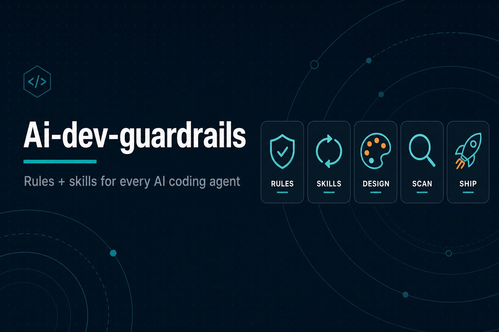

# Ai-dev-guardrails — AI Development Rules & Skills



Reusable **rules** and **skills** for **Cursor**, **Claude**, **Copilot**, **Codex**, **Gemini**, and any AI coding assistant.  
Keep code clean, modular, secure, and consistent — without forcing rules that do not apply to your project.

**Repository:** https://github.com/aftab-ahmad-khan-dev/ai-dev-guardrails  
**Version:** 2.7.0  
**By Aftab Ahmad Khan**

---

## Install in any AI (skills)

This repo is an **installable Agent Skills pack**. One command wires lifecycle skills into your tool:

```bash
# Universal — Cursor, Claude Code, Codex, Gemini, OpenCode, …
npx skills add aftab-ahmad-khan-dev/ai-dev-guardrails

# Browse skills first — grouped by category (meta/define/plan/build/design/verify/review/ship)
npx skills add aftab-ahmad-khan-dev/ai-dev-guardrails --list

# Meta skill only (SRS + Rules + lifecycle entrypoint)
npx skills add aftab-ahmad-khan-dev/ai-dev-guardrails --skill ai-dev-guardrails

# Common essentials
npx skills add aftab-ahmad-khan-dev/ai-dev-guardrails --skill using-agent-skills
npx skills add aftab-ahmad-khan-dev/ai-dev-guardrails --skill test-driven-development
npx skills add aftab-ahmad-khan-dev/ai-dev-guardrails --skill code-review-and-quality
```

After install, keep these at the **project root**:

| File | Role |
|------|------|
| [`SRS.md`](SRS.md) | Project description + living task board |
| [`Rules.md`](Rules.md) | Standards (or copy the YAML packs you need) |

Full per-tool guides: [`INSTALL.md`](INSTALL.md) · [`docs/getting-started.md`](docs/getting-started.md) · [`docs/`](docs/README.md)

**Manual / paste:** load [`skills/meta/ai-dev-guardrails/SKILL.md`](skills/meta/ai-dev-guardrails/SKILL.md) into the system prompt, then add other `skills/*/SKILL.md` as needed.

**Cursor (local sync from clone):**

```bash
mkdir -p .cursor/skills && rsync -a skills/ .cursor/skills/
bash scripts/ensure-skills-gitignore.sh .   # ignore installed copies in the app repo
```

**Consuming apps:** installed skill dirs (`.cursor/skills/`, `.agents/skills/`, `skills-lock.json`, …) must stay **gitignored**. Reinstall with `npx skills add` — do not vendor-commit them.

---

## Quick start

| Goal | Use this |
|------|----------|
| **Install skills** | [`INSTALL.md`](INSTALL.md) · `npx skills add aftab-ahmad-khan-dev/ai-dev-guardrails` |
| **Meta skill** | [`skills/ai-dev-guardrails`](skills/meta/ai-dev-guardrails/SKILL.md) |
| **Project description & tasks** | [`SRS.md`](SRS.md) — living requirements + version/date task board |
| **Everything in one file** | [`Rules.md`](Rules.md) — SRS + LIFECYCLE skills + CS/SS/SEC/OPS + scans |
| **Lifecycle skills** | [`skills/`](skills/README.md) — Define → Plan → Build → Verify → Review → Ship |
| **Design skills** | [`design/`](design/README.md) — Anti-slop, steer vocabulary, motion craft |
| **Personas / checklists / commands** | [`agents/`](agents/README.md) · [`references/`](references/README.md) · [`commands/`](commands/README.md) |
| **Category YAML packs** | `client/`, `server/`, `security/`, `devops/` |
| **Deploy workflow starters** | [`devops/pipelines/`](devops/pipelines/) |
| **Agent entrypoint** | [`AGENTS.md`](AGENTS.md) — Claude Code: [`CLAUDE.md`](CLAUDE.md) · Cursor: [`CURSOR.md`](CURSOR.md) |
| **Self-lint this pack** | `npm run validate` → [`VALIDATION-REPORT.md`](VALIDATION-REPORT.md) — YAML schema + skill frontmatter/category checks |

**Paste into your AI system prompt:**

```text
This pack is rules AND skills (installable via npx skills).
1. Follow skill ai-dev-guardrails (or read SRS.md + Rules.md + skills/).
2. Read SRS.md first for project description and open tasks.
3. Apply Rules.md (applicable sections only — see README matrix).
4. Use matching lifecycle skills from skills/ (spec, TDD, review, ship, …).
5. After each task is done, mark it complete in SRS.md and refresh status / Last updated.
6. Extend SRS.md tasks by version and/or date when scope grows.
7. At the end, output the Compliance Report template from the README.
```

---

## Apply rules by project type

**Do not** force every section on every repo. Detect what the project actually has, then apply only what fits.

| Section | Always apply? | Apply when… |
|---------|---------------|-------------|
| **Variable naming** (Rules §3) | ✅ Yes | Every codebase |
| **Security — core** (SEC-02–06, scans) | ✅ Yes | Every repo with code in git |
| **Client-side** (CS-*) | ✅ Usually | Any UI (web, mobile shell, dashboard) |
| **Security — web/API** (SEC-07–13) | ⚙️ Context | App has auth, API, or user input |
| **Server-side** (SS-*) | ⚙️ Context | Backend, API, or serverless routes exist |
| **DevOps** (OPS-*) | ⚙️ Context | CI/CD, Docker, or a deploy target exists |
| **Platform playbooks** (OPS-03–08) | ⚙️ One only | Match your host (Vercel, EC2, Railway, …) |
| **Lifecycle skills** (`skills/`) | ✅ Usually | Match the current phase (don’t load all at once) |
| **Design skills** (`design/`) | ⚙️ Context | Any user-facing UI that must avoid AI slop / needs motion craft |

### Examples

| Project | Apply | Skip / N/A |
|---------|--------|------------|
| Static marketing site (React) | CS-*, naming, SEC-02–06, SEC-10, scans, frontend/TDD skills | SS-*, OPS-03–08 (unless Vercel deploy) |
| Full-stack SaaS | CS-*, SS-*, security, devops, scans, full lifecycle skills | Only unused platform playbooks |
| API-only (no frontend) | SS-*, naming, security, devops, API/TDD skills | CS-07 (SEO/OG), CS-09 (motion), CS-20 (PWA), frontend-ui skill |
| Library / CLI | Naming, SEC-02–06, scans, TDD + review skills | CS-*, most OPS deploy rules |
| Local prototype | Naming, SEC-02–06 (no real secrets), lightweight skills | Strict CI gates until shipping |

**AI instruction:** Before generating code, state which rule sections **and** which lifecycle skills you are applying and why. Mark skipped sections `N/A` in the compliance report — do not invent backend or deploy rules for a frontend-only task.

---

## Repo structure

```
ai-dev-guardrails/
├── SRS.md                   # ← Project description + version/date task board (template)
├── Rules.md                 # ← Rules + SRS/LIFECYCLE skills + all standards in one file
├── AGENTS.md                # ← Agent entrypoint (SRS + rules + skills)
├── CLAUDE.md / CURSOR.md    # ← Maintainer feature trackers for this repo (not a reusable asset)
├── README.md                # ← This file (install + how to apply + report template)
├── plugin.json              # ← Pack manifest (name / version)
├── package.json             # ← `npm run validate` (self-lint) + devDependencies
├── VALIDATION-REPORT.md     # ← Latest self-lint run (YAML schema + skill checks)
├── skills/                  # ← Installable skills, grouped by category for `npx skills add --list`
│   ├── meta/ define/ plan/ build/ verify/ review/ ship/   # 28 lifecycle skills
│   └── design/                                            # 79 design skills (11 core + 68 approaches)
├── design/                  # ← Design skill pack (anti-slop, steer, motion) + refs
├── agents/                  # ← Specialist personas (reviewer, security, …)
├── references/              # ← Checklists (DoD, security, a11y, perf, design, …)
├── commands/                # ← Slash-command stubs (+ commands/claude/)
├── scripts/                 # ← validate.js (self-lint), inject-skill-commands.py, gitignore helper
├── hooks/                   # ← Session lifecycle hooks
├── docs/                    # ← Per-tool setup (Cursor, Claude, Copilot, …)
├── client/                  # CS-01…CS-20 (YAML) + banner
├── server/                  # SS-01…SS-20 (YAML) + banner
├── security/                # SEC-01…SEC-20 (YAML) + banner
└── devops/                  # OPS-01…OPS-20 (YAML) + pipelines/ + banners
```

YAML packs and `Rules.md` stay in sync. Prefer **`Rules.md`** for a single paste; use **folder YAML** when you only need one layer.  
Copy **`SRS.md`** into each consuming project and fill description + tasks — that file is the living backlog the AI must maintain.  
Prefer **`npx skills add`** so skills land in the correct agent directory; or sync **`skills/`** into `.cursor/skills/` for Cursor (see [`skills/README.md`](skills/README.md)).

---

## Rules vs skills

| | **Rules** | **SRS skills** | **Lifecycle skills** |
|---|-----------|----------------|----------------------|
| **What** | Quality / security / delivery standards (CS-*, SS-*, SEC-*, OPS-*) | How the AI runs the task board | Engineering workflows (spec, TDD, review, ship) |
| **Where** | `Rules.md` §§1–6 + YAML packs | `Rules.md` §0 (SRS-01, SRS-02) | `skills/*/SKILL.md` · `design/` · Rules §0 LIFECYCLE-* |
| **Install** | Paste / copy YAML | Included in meta skill | `npx skills add …` |
| **Example** | “No file over 400 LOC” | “Read `SRS.md`, finish `T-003`, mark `done`” | “Red-green-refactor before merge” |

---

## Lifecycle skill map

| Phase | Command | Skills |
|-------|---------|--------|
| Meta | — | `ai-dev-guardrails`, `using-agent-skills` |
| Define | `/spec` | `interview-me`, `idea-refine`, `spec-driven-development` |
| Plan | `/plan` | `planning-and-task-breakdown` |
| Build | `/build` | `incremental-implementation`, `test-driven-development`, `frontend-ui-engineering`, `api-and-interface-design`, `context-engineering`, `source-driven-development`, `doubt-driven-development` |
| Design | — | `using-design-skills`, `anti-slop-frontend`, `style-*` / `steer-*` / motion approaches — see [`design/COMMANDS.md`](design/COMMANDS.md) |
| Verify | `/test` `/scan` `/validate` | `browser-testing-with-devtools`, `debugging-and-error-recovery`, `project-functionality-scan`, `self-validate` |
| Review | `/review` | `code-review-and-quality`, `code-simplification`, `security-and-hardening`, `performance-optimization` |
| Ship | `/ship` | `git-workflow-and-versioning`, `ci-cd-and-automation`, `deprecation-and-migration`, `documentation-and-adrs`, `observability-and-instrumentation`, `shipping-and-launch` |

Also: `/webperf`, `/code-simplify` — see [`commands/`](commands/README.md). Personas: [`agents/`](agents/README.md). Checklists: [`references/`](references/README.md).

---

## SRS-driven delivery (mandatory skill)

**Source of truth for product detail and tasks:** [`SRS.md`](SRS.md)

1. **Read `SRS.md`** — project description, roadmap, and open tasks (by version and/or date).
2. **Pick a task** — prefer current-version `todo` / continue `in_progress`; announce the task ID.
3. **Choose lifecycle skill(s)** — from the map above (or follow `ai-dev-guardrails` / `using-agent-skills`).
4. **Apply rules** — only sections that match project type (matrix above).
5. **Mark complete** — set status `done`, fill **Completed** date + **Notes**, bump **Last updated**.
6. **Extend when needed** — add rows under a version section or a dated backlog; update roadmap when versions change.
7. **Report** — emit the compliance report after a reviewable slice.

Do not delete task history; use `cancelled` with a reason. If `SRS.md` is missing, scaffold from this template before large work.

---

## How AI should follow rules effectively

1. **Load meta skill** — Prefer `ai-dev-guardrails` when this pack is installed.
2. **Read `SRS.md`** — description, current version, open tasks.
3. **Choose lifecycle skill(s)** — From `skills/` when the work matches (spec, plan, TDD, review, ship, …).
4. **Read applicability** — Confirm project type (frontend / backend / full-stack / deploy target).
5. **Load relevant sections** — From `Rules.md` or merged YAML packs.
6. **Respect existing conventions** — Server rules extend the boilerplate; naming mirrors the codebase.
7. **Refuse violations** — No secrets in code, no `.cursor/` in commits, no proprietary logic in client bundles.
8. **Estimate file size** — Split before 400 LOC (CS-01 / SS-01).
9. **Update `SRS.md`** — mark finished tasks `done`; extend by version/date if scope grew.
10. **Before push, run the local gate** — tests, lint/typecheck, dependency audit, secret scan, client-exposure scan, and build where configured. Fix failures before pushing.
11. **Emit compliance report** — After implementation or review (template below); include SRS task IDs and skill names in **Scope**.

### Always-on (every project)

- Variable naming (Rules §3)
- Secrets & env hygiene (SEC-02, SEC-03)
- Never commit AI workspace files (SEC-04)
- Confidential code & AI mistake prevention (SEC-05, SEC-06)
- Dependency / secret scanning where `package.json` exists (SEC-01, Rules §6)
- Local pre-push test/security gate; remote CI is a second gate, not the first feedback loop
- Treat `VITE_*` / `NEXT_PUBLIC_*` as public. Flag hardcoded analytics/tracking IDs and real fallback literals.

### Common-only (no backend)

- Skip server-side rules (§2) unless adding an API later
- Keep client env rules (CS-16) — client bundle is still public
- Stats sections require a visible bottom border/divider and realistic, sourced metrics. Never fabricate vanity numbers; use labeled placeholders or omit the section when evidence is unavailable (CS-12).
- Skip DB migrations, RBAC server rules, CORS unless calling an external API

### Common-only (no deployment yet)

- Skip DevOps §5 and platform playbooks OPS-03–08
- Still apply SEC-02–06 and local pre-commit scans

---

## Compliance report template

After **implementing features**, **reviewing PRs**, or **running security checks**, output this report in the chat / logs.  
Use clear status icons and honest `N/A` when a category does not apply.

```text
╔══════════════════════════════════════════════════════════════════╗
║           AI RULES COMPLIANCE REPORT                             ║
╠══════════════════════════════════════════════════════════════════╣
║  Project : <name or path>                                        ║
║  Type    : <e.g. React SPA · no backend · Vercel deploy>         ║
║  Date    : <ISO date>                                            ║
║  SRS     : <task IDs e.g. T-002, T-003 — statuses updated in SRS.md> ║
║  Skills  : <e.g. ai-dev-guardrails, test-driven-development>         ║
║  Scope   : <what was built or reviewed>                          ║
╚══════════════════════════════════════════════════════════════════╝

┌─────────────────────────────┬──────────┬────────────────────────────┐
│ Category                    │ Status   │ Notes                      │
├─────────────────────────────┼──────────┼────────────────────────────┤
│ Naming conventions          │ PASS     │ camelCase / PascalCase OK  │
│ Client-side rules           │ PASS     │ 12 rules checked           │
│ Server-side rules           │ N/A      │ No backend in this project │
│ Security — secrets & env    │ PASS     │ No hardcoded secrets       │
│ Security — confidentiality  │ PASS     │ No .cursor/ in diff        │
│ Security — AI safety        │ PASS     │ No pasted prod keys        │
│ Security — injection/XSS    │ WARN     │ Review 1 raw HTML path     │
│ Security scan — deps        │ PASS     │ npm audit: 0 high/critical │
│ Security scan — secrets     │ PASS     │ gitleaks: clean            │
│ Client config exposure      │ PASS     │ No literal tracking IDs    │
│ Security scan — lint/test   │ PASS     │ lint + test green          │
│ DevOps / CI                 │ N/A      │ No pipeline in repo yet    │
│ DevOps — platform           │ N/A      │ Not deploying this task    │
└─────────────────────────────┴──────────┴────────────────────────────┘

Status legend:
  PASS  — Checked and compliant
  WARN  — Checked; minor issue or follow-up recommended
  FAIL  — Must fix before merge/deploy
  N/A   — Not applicable to this project or task

── Scans executed ────────────────────────────────────────────────
  [✓] Secret scan          (gitleaks / manual diff review)
  [✓] Dependency audit     (npm audit --audit-level=high)
  [✓] Client exposure scan (no hardcoded tracking IDs/fallbacks)
  [✓] Local pre-push gate  (tests + scans passed before push)
  [✓] .gitignore / AI paths (SEC-04)
  [ ] SAST                 (not configured)
  [ ] Docker image scan    (N/A — no Dockerfile)

── Rules applied (sample) ───────────────────────────────────────
  CS-01  File modularity ≤400 LOC          PASS
  CS-16  No secrets in client env        PASS
  SEC-05  Confidential logic server-side N/A
  SEC-06  AI paste / commit hygiene      PASS

── Action items ──────────────────────────────────────────────────
  1. [WARN] Sanitize user HTML in ProfileBio.tsx (SEC-10)
  2. [INFO] Add npm audit to CI when pipeline is added (SEC-01)

── Summary ───────────────────────────────────────────────────────
  PASS: 8   WARN: 1   FAIL: 0   N/A: 4
  Verdict: ✅ Safe to proceed (address WARN before production)
```

**AI directive for reports**

- Never mark `PASS` without actually checking that category.
- List which scans ran and which were skipped (with reason).
- Include specific rule IDs (CS-*, SS-*, SEC-*, OPS-*) for `WARN` and `FAIL`.
- Confirm `SRS.md` was updated for every completed task ID listed under **SRS**.
- List which lifecycle skills were followed (or `N/A` if none matched).
- End with a one-line **Verdict**: safe to proceed / fix required / blocked.

---

## Security scan quick reference

Full checklist: **[Rules.md §6 — Security Scan](Rules.md#6-security-scan-checklist)**

| When | Minimum scans |
|------|----------------|
| Every commit | No staged `.env`, `.cursor/`, `.claude/`, `*.pem` |
| **Every pre-push (local)** | Tests, lint/typecheck, dependency audit, gitleaks, client-exposure scan, build where configured |
| PR (recommended) | `gitleaks detect`, lockfile review |
| Pre-deploy | Full CI green, secrets in platform store, HTTPS |

The pre-push gate must print results locally and block the push on failed tests or high/critical findings. Fix and rerun before pushing; do not bypass it with `--no-verify` except under documented emergency approval. CI must repeat the checks.

**Client configuration warning:** `VITE_*` and `NEXT_PUBLIC_*` values are embedded in the browser bundle. Meta Pixel IDs, Clarity project IDs, GA measurement IDs, and similar identifiers are public—not secured by an env file. Keep production values out of source literals and fallback arrays, load them from validated client-safe deployment env vars, and keep actual tokens/secrets server-only.

---

## YAML schema (for pack authors)

```yaml
rules:
  - id: CS-01
    title: Human-readable name
    status: complete
    severity: critical | high | medium | low
    summary: >
    rules: [ ... ]
    do: [ ... ]
    dont: [ ... ]
    ai_directive: >
```

---

## Rule & skill index

| Pack | File | Count | Focus |
|------|------|-------|-------|
| SRS board | [SRS.md](SRS.md) | template | Project description + version/date tasks |
| All | [Rules.md](Rules.md) | SRS + LIFECYCLE + 80 + naming + scans | Rules & skills in one file |
| [skills](skills/README.md) | lifecycle + design | 107 | Spec → ship (28, incl. self-validate) + 79 design approaches |
| [design](design/README.md) | design | 79 | Approaches, steer, styles, motion, safe-file-ops |
| [REPORT.md](REPORT.md) | ops | — | Per-push security / quality log (`push-report` skill) |
| [SCAN-REPORT.md](SCAN-REPORT.md) / [.svg](SCAN-REPORT.svg) | verify | — | Functionality scan (`/scan`) |
| [VALIDATION-REPORT.md](VALIDATION-REPORT.md) | verify | — | Pack self-lint (`npm run validate` / `/validate`) |
| [skills/COMMANDS.md](skills/COMMANDS.md) | meta | — | Slash-command deck for all skills |
| [agents](agents/README.md) | personas | 4 | Reviewer, test, security, webperf |
| [references](references/README.md) | checklists | 7 | DoD, testing, security, a11y, perf, … |
| [commands](commands/README.md) | slash cmds | 8 | `/spec` `/plan` `/build` `/test` `/review` `/ship` … |
| [hooks](hooks/README.md) | session | scripts | Session-start / cache hooks |
| [docs](docs/README.md) | guides | multi | Install on Cursor, Claude, Copilot, … |
| [client](client/README.md) | `CS` | 20 | Modularity, UX, a11y, SEO, Tailwind |
| [server](server/README.md) | `SS` | 20 | Layers, REST, auth, jobs, migrations |
| [security](security/README.md) | `SEC` | 20 | Confidentiality, AI safety, injection |
| [devops](devops/README.md) | `OPS` | 20 | CI/CD, platforms, pipelines |
| [pipelines](devops/pipelines/README.md) | Actions | 6 starters | Platform deploy workflow templates |

Each category folder README includes a thematic `banner.jpg` for GitHub browsing (root + `client` / `server` / `security` / `devops` + `skills` / `design` / `agents` / `references` / `commands` / `hooks` / `docs`).

---

## Author

**By Aftab Ahmad Khan** · [GitHub](https://github.com/aftab-ahmad-khan-dev)

## License

This project is licensed under the [MIT License](LICENSE).  
Copyright (c) 2026 Aftab Ahmad Khan.

Portions of the lifecycle skill pack were adapted from [addyosmani/agent-skills](https://github.com/addyosmani/agent-skills); required upstream notice is retained in [LICENSE](LICENSE).

---

## Contributing

- Run `npm run validate` after adding/moving a skill or editing a YAML rule pack; fix any `FAIL` before pushing.
- New skills go under `skills/<category>/<name>/SKILL.md` — category is one of `meta/define/plan/build/design/verify/review/ship`.
- Update install docs when the public GitHub skills path or `npx skills` flags change.
- Keep `Rules.md` in sync when YAML packs change.
- Keep `SRS.md` current when this pack’s own roadmap/tasks change.
- When refreshing lifecycle skills, keep the upstream notice in `LICENSE` and re-check Cursor docs paths.
- One rule = one testable directive; skills document mandatory workflows.
- Never commit real secrets, `.env`, or AI-workspace files (SEC-04, SEC-06).
