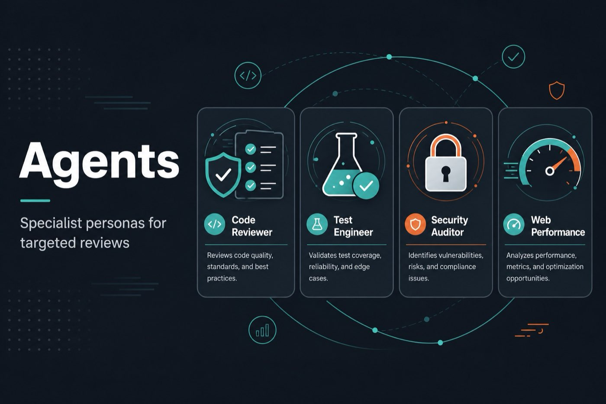

# agents — Specialist Personas

Pre-configured agent personas for targeted reviews. Use with lifecycle skills under [`../skills/`](../skills/).

| Agent | Role |
|-------|------|
| [code-reviewer](code-reviewer.md) | Five-axis review — staff-engineer bar |
| [test-engineer](test-engineer.md) | Test strategy, coverage, Prove-It |
| [security-auditor](security-auditor.md) | Threat modeling, OWASP, secrets |
| [web-performance-auditor](web-performance-auditor.md) | Core Web Vitals — via `/webperf` |

See [`../docs/agents.md`](../docs/agents.md) for orchestration rules.
