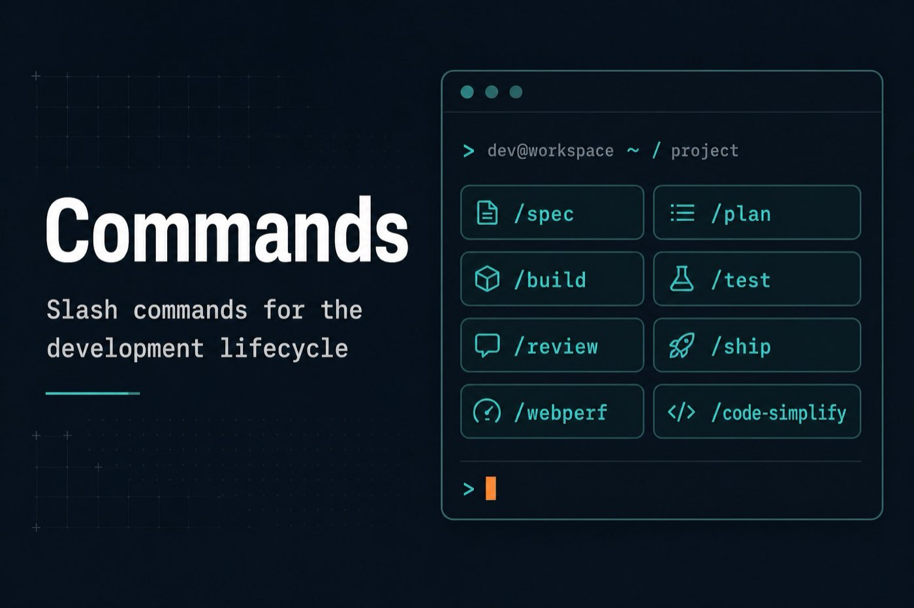

# commands — Slash Commands

Lifecycle slash-command stubs. Copy into your agent’s command directory (or use the installer for your tool).

| Command | Phase |
|---------|-------|
| `/spec` | Define |
| `/plan` | Plan |
| `/build` | Build |
| `/test` | Verify |
| `/review` | Review |
| `/code-simplify` | Review |
| `/webperf` | Review |
| `/ship` | Ship |

- Antigravity / TOML: `*.toml` in this folder  
- Claude Markdown: [`claude/`](claude/)  
- Skill wiring: [`../skills/`](../skills/) · [`../docs/getting-started.md`](../docs/getting-started.md)
