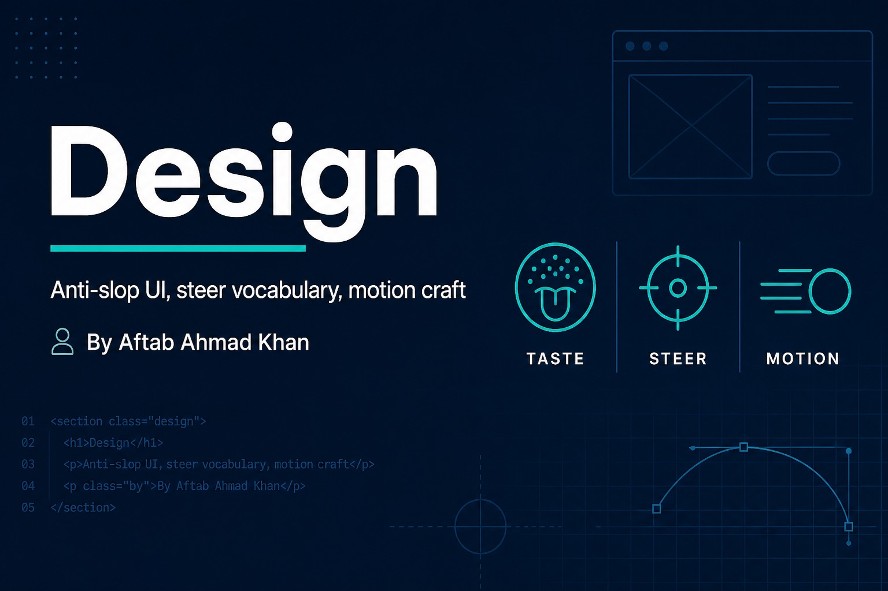

# design — Anti-Slop Design Skill Pack (60+ approaches)



**By Aftab Ahmad Khan**

Production design skills for AI coding agents — taste, steer vocabulary, visual styles, motion craft, and workflows.

Inspired by [Taste Skill](https://www.tasteskill.dev/), [Impeccable](https://impeccable.style/), and [Emil Kowalski’s skills](https://emilkowal.ski/skill). Original writing for this pack. See [`SAFETY.md`](SAFETY.md) before install.

**Command deck:** [`COMMANDS.md`](COMMANDS.md) — every approach has a `/slash-command`.

## Install (safe)

```bash
# Preferred — never rsync into the project root
npx skills add aftab-ahmad-khan-dev/ai-dev-guardrails

# Cursor local sync — DESTINATION must be .cursor/skills/ ONLY (no --delete)
mkdir -p .cursor/skills
rsync -a /path/to/ai-dev-guardrails/skills/ .cursor/skills/
```

**Forbidden:** `rsync --delete`, syncing this pack onto `./`, `rm -rf` “cleanup”. Details: [`SAFETY.md`](SAFETY.md) · [`safe-file-ops`](safe-file-ops/SKILL.md).

## What’s included

| Layer | Count | Location |
|-------|------:|----------|
| Core skills | 11 | `anti-slop-frontend`, `design-steer`, `motion-craft`, `safe-file-ops`, … |
| Approaches | 68 | [`approaches/`](approaches/README.md) — `style-*`, `steer-*`, `motion-*`, workflows |
| References | 4 | [`references/`](references/) |
| Push report | 1 | [`../skills/push-report`](../skills/push-report/SKILL.md) → `REPORT.md` |

## Start here

1. [`using-design-skills`](using-design-skills/SKILL.md) — router  
2. [`safe-file-ops`](safe-file-ops/SKILL.md) — never wipe a repo  
3. [`anti-slop-frontend`](anti-slop-frontend/SKILL.md) or a `style-*` / `steer-*` approach  
4. Before push: `push-report` → updates root [`REPORT.md`](../REPORT.md)

## Maintain

```bash
python3 design/generate-approaches.py   # regenerate approaches from catalog
./design/sync-to-skills.sh              # mirror into skills/ for npx
```

## Attribution

| Upstream | Site |
|----------|------|
| Taste Skill | [tasteskill.dev](https://www.tasteskill.dev/) |
| Impeccable | [impeccable.style](https://impeccable.style/) |
| Emil Kowalski skills | [emilkowal.ski/skill](https://emilkowal.ski/skill) |
