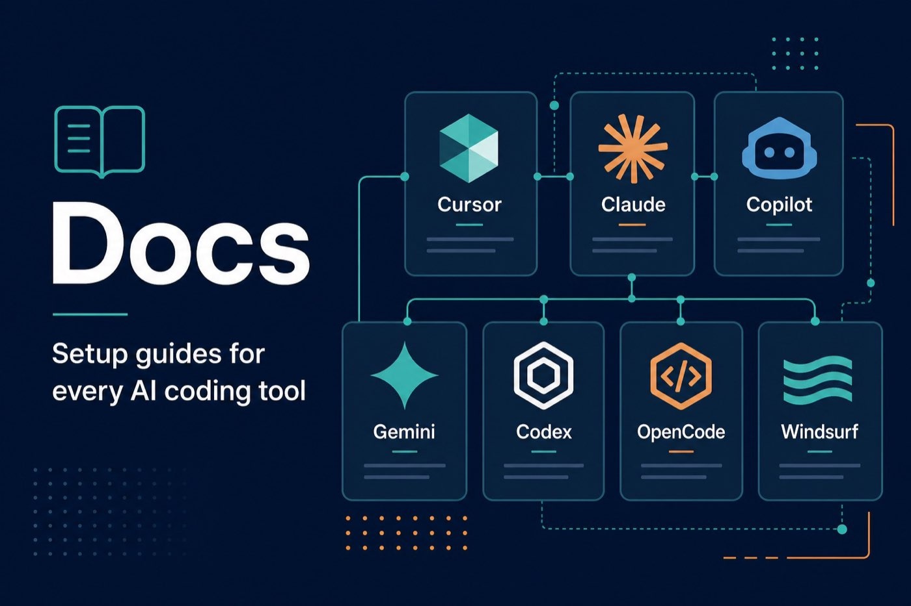

# docs — Setup Guides



How to install **ai-dev-guardrails** on every major AI coding tool.

| Guide | Tool |
|-------|------|
| [getting-started.md](getting-started.md) | Any agent (universal) |
| [cursor-setup.md](cursor-setup.md) | Cursor |
| [copilot-setup.md](copilot-setup.md) | GitHub Copilot |
| [gemini-cli-setup.md](gemini-cli-setup.md) | Gemini CLI |
| [codex-setup.md](codex-setup.md) | Codex |
| [opencode-setup.md](opencode-setup.md) | OpenCode |
| [antigravity-setup.md](antigravity-setup.md) | Antigravity |
| [windsurf-setup.md](windsurf-setup.md) | Windsurf |
| [adoption-guide.md](adoption-guide.md) | Team rollout |
| [skill-anatomy.md](skill-anatomy.md) | Authoring skills |
| [agents.md](agents.md) | Personas |

**One-liner install:**

```bash
npx skills add aftab-ahmad-khan-dev/ai-dev-guardrails
```
