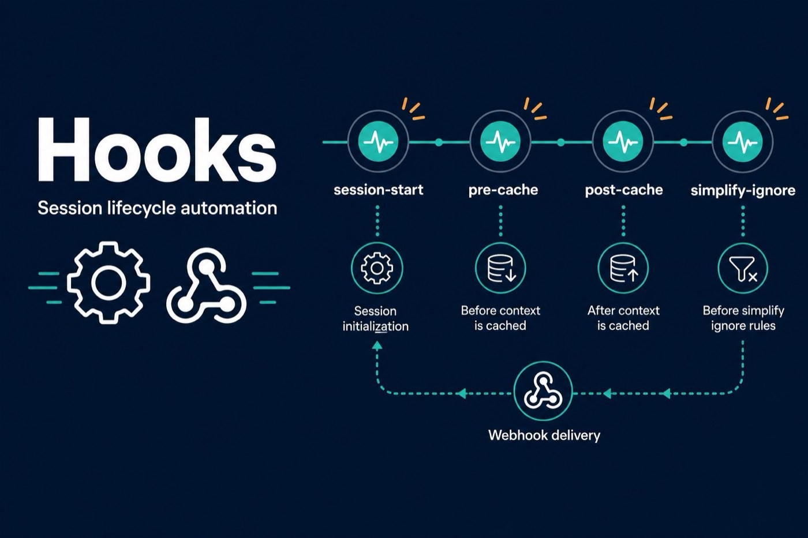

# hooks — Session Lifecycle

Optional session hooks (cache, simplify-ignore, session-start). Use when your agent supports hook scripts.

| File | Purpose |
|------|---------|
| [hooks.json](hooks.json) | Hook registry |
| [session-start.sh](session-start.sh) | Session bootstrap |
| [sdd-cache-pre.sh](sdd-cache-pre.sh) / [sdd-cache-post.sh](sdd-cache-post.sh) | Spec-driven cache |
| [simplify-ignore.sh](simplify-ignore.sh) | Code-simplify ignore list |

See skill docs under [`../docs/`](../docs/) for agent-specific wiring.
