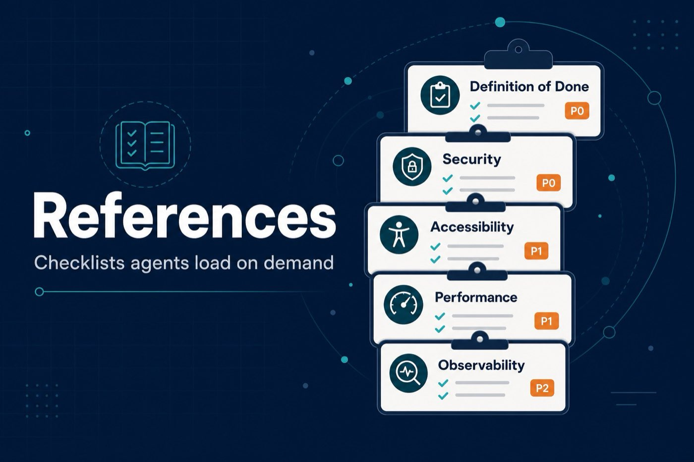

# references — Checklists

On-demand checklists that skills pull in when needed. Keep them out of always-on context until a skill asks for them.

| Reference | Covers |
|-----------|--------|
| [definition-of-done.md](definition-of-done.md) | Standing bar every change clears |
| [testing-patterns.md](testing-patterns.md) | Structure, naming, mocking, anti-patterns |
| [security-checklist.md](security-checklist.md) | Auth, input, headers, OWASP |
| [performance-checklist.md](performance-checklist.md) | Core Web Vitals, measure-first |
| [accessibility-checklist.md](accessibility-checklist.md) | Keyboard, SR, ARIA, WCAG |
| [observability-checklist.md](observability-checklist.md) | Logging, RED/USE, tracing, alerts |
| [orchestration-patterns.md](orchestration-patterns.md) | Multi-persona patterns |

Pair with [`../skills/`](../skills/) and [`../Rules.md`](../Rules.md).
