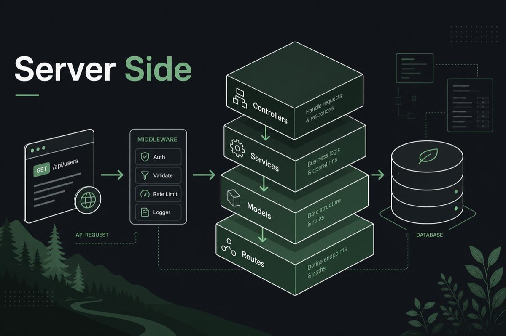

# server_side — Backend Rule Pack

Rules for extending an **existing API boilerplate** without changing its
architecture. The prime directive: *extend the boilerplate, never replace it*.

Paste [`server-side-rules.yaml`](server-side-rules.yaml) into your AI tool
before generating backend code.

**Assumed structure:** Controllers · Services · Models · Routes · Middlewares ·
Database · Startup · Templates

**Source:** AI Dev Rules Master Prompt Pack — Part 2 (v2.0.0)

## Index (20 rules · prefix `SS`)

| ID | Rule | Severity |
|----|------|----------|
| SS-01 | Layered architecture & code organization | critical |
| SS-02 | API design & REST conventions | high |
| SS-03 | Database schema & migrations | high |
| SS-04 | Error handling & centralized exception middleware | high |
| SS-05 | Input validation (server-side) | critical |
| SS-06 | Authentication & session management | critical |
| SS-07 | Authorization & RBAC | critical |
| SS-08 | Logging & monitoring | medium |
| SS-09 | Caching strategy | medium |
| SS-10 | Background jobs & queues | high |
| SS-11 | Rate limiting & throttling | high |
| SS-12 | File upload handling | high |
| SS-13 | Environment & configuration management | critical |
| SS-14 | Testing standards (backend) | medium |
| SS-15 | API versioning | medium |
| SS-16 | Pagination, filtering & sorting | medium |
| SS-17 | Transaction management & data integrity | critical |
| SS-18 | Third-party service integration | high |
| SS-19 | Performance & scalability | high |
| SS-20 | API documentation | medium |

> **Status:** All 20 rules are fully written (`status: complete`).
