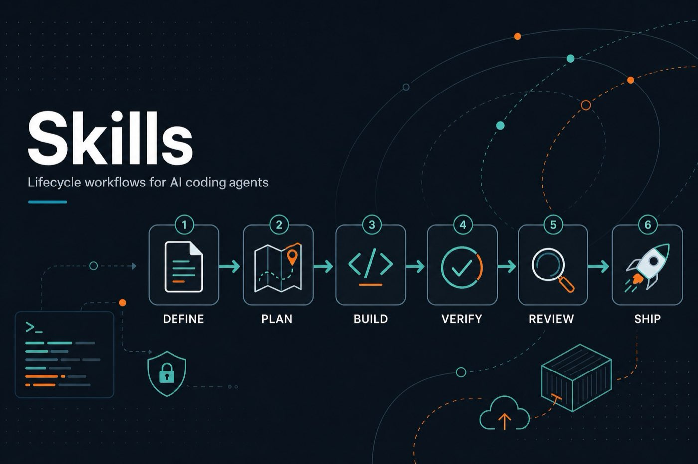

# skills — Lifecycle Skill Pack



Production workflows for AI coding agents. Each folder is an installable skill (`SKILL.md`) for Cursor, Claude, Copilot, Codex, Gemini, and any agent that supports the Agent Skills format.

**Command deck (fun + searchable):** [`COMMANDS.md`](COMMANDS.md) — every skill has a `/slash-command` in its `SKILL.md`.

**Install everywhere:**

```bash
npx skills add aftab-ahmad-khan-dev/ai-dev-guardrails
npx skills add aftab-ahmad-khan-dev/ai-dev-guardrails --list
npx skills add aftab-ahmad-khan-dev/ai-dev-guardrails --skill ai-dev-guardrails
```

| Layer | Role |
|-------|------|
| **SRS** | [`../SRS.md`](../SRS.md) — what to build |
| **Rules** | [`../Rules.md`](../Rules.md) — quality / security standards |
| **Skills** | this folder — how to build |

## Index

| Phase | Skills |
|-------|--------|
| Meta | `ai-dev-guardrails`, `using-agent-skills` |
| Define | `interview-me`, `idea-refine`, `spec-driven-development` |
| Plan | `planning-and-task-breakdown` |
| Build | `incremental-implementation`, `test-driven-development`, `frontend-ui-engineering`, `api-and-interface-design`, `context-engineering`, `source-driven-development`, `doubt-driven-development` |
| Design | `using-design-skills`, `safe-file-ops`, + 68 approaches (`style-*`, `steer-*`, `motion-*`, workflows) — see [`../design/approaches/`](../design/approaches/README.md) |
| Verify | `browser-testing-with-devtools`, `debugging-and-error-recovery`, `project-functionality-scan` |
| Review | `code-review-and-quality`, `code-simplification`, `security-and-hardening`, `performance-optimization` |
| Ship | `git-workflow-and-versioning`, `push-report`, `ci-cd-and-automation`, `deprecation-and-migration`, `documentation-and-adrs`, `observability-and-instrumentation`, `shipping-and-launch` |

Start with [`ai-dev-guardrails`](ai-dev-guardrails/SKILL.md) or [`using-agent-skills`](using-agent-skills/SKILL.md).

**Design pack:** canonical source is [`../design/`](../design/README.md) (~70 approaches). Mirrored here for `npx skills add`. **Safety:** [`../design/SAFETY.md`](../design/SAFETY.md). **Push log:** [`push-report`](push-report/SKILL.md) → root `REPORT.md`.

See also: [`docs/getting-started.md`](../docs/getting-started.md) · [`docs/cursor-setup.md`](../docs/cursor-setup.md)
